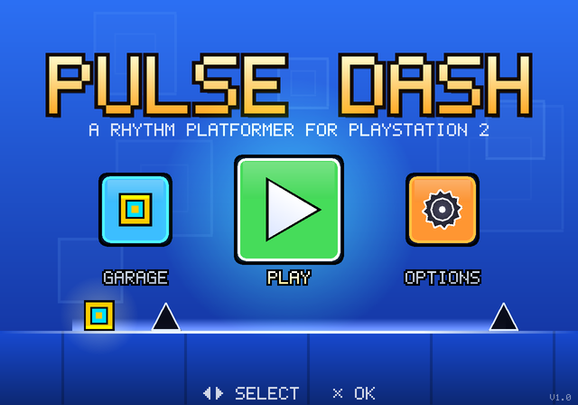
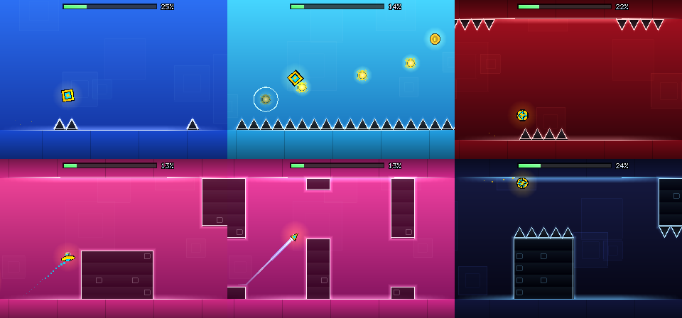
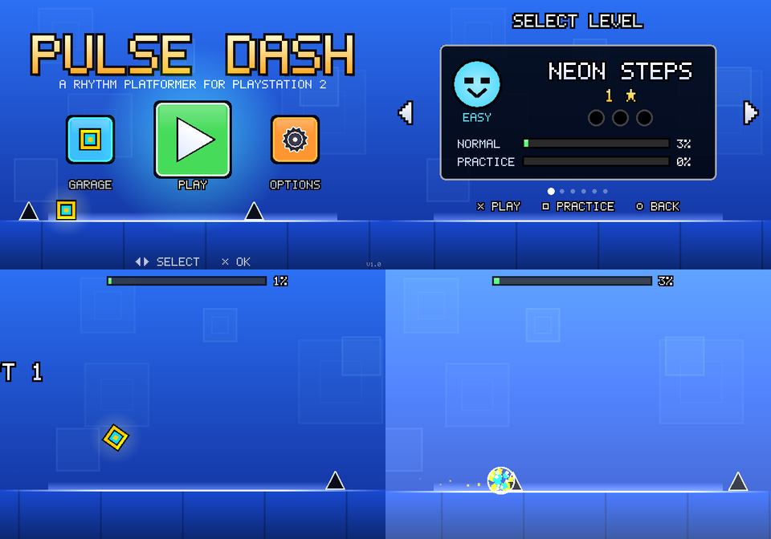
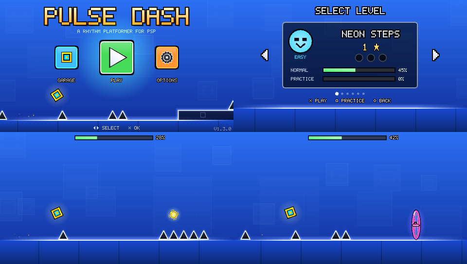

# Pulse Dash

A rhythm platformer for the **PlayStation 2** and the **PSP**, inspired by
Geometry Dash: tap to jump, hold to fly, and get through each level in one
go, in time with the music.



All levels, music, graphics and code in this repository are original. The
game plays like Geometry Dash (the vehicles, orbs, pads, portals, practice
mode) but contains none of its levels, songs, artwork, names or code. It is
an unofficial fan project, not affiliated with or endorsed by RobTop Games;
"Geometry Dash" is their trademark.



## Features

- **6 levels**, Easy to Demon, each with its own song, palette changes and 3
  secret coins: Neon Steps, Skyward Pulse, Gravity Garden, Saucer Groove,
  Wave Rider, Prism Overdrive.
- **Every jump is on the beat**: each level is checked to be beatable when
  every tap lands on an 8th note of its song, and blocks, spikes, orbs and
  pads pulse with the music. If the sound arrives late or early on your TV
  (soundbars and AV receivers add delay), set **Options > Audio delay**: a
  metronome plays and four lights flash with the beat; move the value until
  the flashes land on the kick.
- **A live title screen**: behind the menu the game plays a short loop of
  level with the real engine, jumping on the beat of the menu music.
- **5 vehicles**: cube, ship, ball, UFO and wave, plus gravity flips and four
  speeds.
- Yellow/pink/blue/green **orbs**, yellow/pink/blue **pads**, spikes, saws.
- **Practice mode** with checkpoints, attempt counter, best-percent tracking,
  pause menu, level-complete stats.
- **Garage**: 8 cube designs, 14 colours, previews of every vehicle.
- **Original soundtrack, synthesized live**: a small software synth (supersaw
  leads, plucks, filtered bass, drums with sidechain, echo) plays 8 original
  tracks from note data in `src/core/songs.c`. No audio files ship with the
  game.
- **Memory card saves** (`mc0:/PULSEDASH`, with a browser icon), falling back
  to the second slot. On the PSP, progress is saved next to the game on the
  memory stick.
- Vector graphics drawn entirely from GS primitives (no textures), 640x448.
  NTSC (59.94 Hz) and PAL (50 Hz): the game logic runs at a fixed 60 Hz and
  every frame is drawn interpolated to the moment it is shown, so the
  scrolling is even at either refresh rate.
- **On the PSP** the game fills the 16:9 screen: levels show more of what is
  ahead, the menus are laid out for it, and text, icons and outlines are
  drawn on whole pixels of the 480x272 LCD so they stay sharp and even. It
  has its own XMB icon and background, drawn by the game's renderer.

## Controls

| Button | Action |
|--------|--------|
| ✕ / ○ / ↑ / L1 / R1 (L / R on the PSP) | Jump; hold to fly (ship) or climb (wave) |
| START | Pause |
| □ (practice) | Place checkpoint |
| △ (practice) | Remove last checkpoint |
| ✕ / □ / ○ in the level menu | Play / practice / back |

On the PSP the analog nub works like the d-pad, and HOME > Quit saves any
unsaved progress before the game exits.

## Running it

**On a PS2:** download `PULSEDASH.ELF` from the latest
[release](../../releases/latest) (or build it, below), copy it to a USB
stick or memory card and launch it with wLaunchELF/uLaunchELF (for example from
FreeMcBoot), or from OPL's apps list. The version is shown in the corner of
the title screen.
Any controller in port 1 or 2 works; progress is saved to the memory card
in slot 1 (or slot 2).

**On a PSP:** download `pulsedash-<version>-psp.zip` from the latest
[release](../../releases/latest) and unzip it onto the memory stick: it
creates `PSP/GAME/PulseDash/EBOOT.PBP`. Pulse Dash then shows up in the XMB's
Game menu. Homebrew needs custom firmware (for example ARK-4 or PRO); a PS
Vita runs it through Adrenaline. Progress is saved in `SAVE.DAT` in the same
folder.

**In an emulator:** [Play!](https://purei.org) boots the PS2 ELF directly
(File > Boot ELF), no BIOS needed. PCSX2 can boot it too ("Run ELF") with
your own BIOS dump. [PPSSPP](https://www.ppsspp.org) runs the PSP version
(open `EBOOT.PBP`).

**On a PC:** the same game builds as an SDL2 program (keyboard: Space/Up to
jump, Esc to pause, Q/E for checkpoints, Backspace to go back; gamepads
work too).

## Building

PS2, using the official toolchain image (needs Docker):

```sh
scripts/build-ps2.sh          # -> build/ps2/PULSEDASH.ELF
```

`PULSEDASH.ELF` is compressed with ps2-packer and unpacks itself at boot
(about 200 KB instead of 2.4 MB). The build also leaves
`pulsedash-unpacked.elf` next to it: the same program with debug symbols,
for debugging in an emulator.

or with a local [ps2dev](https://github.com/ps2dev/ps2dev) install
(`PS2DEV`, `PS2SDK`, `GSKIT` set): `make`.

Builds show `git describe` on the title screen (the tag for a release, else
the commit); `make VERSION=...` overrides it.

PSP, using the official toolchain image (needs Docker):

```sh
scripts/build-psp.sh          # -> build/psp/EBOOT.PBP
```

or with a local [pspdev](https://github.com/pspdev/pspdev) install
(`psp-config` on `PATH`): `make -f Makefile.psp`. The build also leaves
`pulsedash.elf` next to the EBOOT, with debug symbols. The XMB icon and
background in `src/psp/` are drawn by the game itself:
`make -f Makefile.host PSP=1 psp-art` redraws them.

PC version and developer tools (needs SDL2):

```sh
make -f Makefile.host         # -> build/host/pulsedash, build/host/pd_tool
build/host/pulsedash
```

`make -f Makefile.host PSP=1` builds the same in the PSP's widescreen layout
(in `build/host-psp/`), to try it out on a PC; `pd_tool shot` and
`pd_tool menu` take an output width, so `... menu title out.png 1 480` shows
a screen exactly as the PSP draws it.

GitHub Actions builds the ELF and the EBOOT (uploaded as artifacts) and runs
the tests on every push.

### Releases

Describe the version in [CHANGELOG.md](CHANGELOG.md) (a `## [1.1.0] - date`
section), then push a version tag; CI publishes a GitHub release once the
tests and the PS2 and PSP builds pass:

```sh
git tag v1.1.0
git push origin v1.1.0
```

The release carries `PULSEDASH.ELF`, a zip with it plus the README,
changelog and licenses, a PSP zip (`PSP/GAME/PulseDash/` with the EBOOT and
the same documents) and `SHA256SUMS`. Its notes are the
version's changelog section followed by the merged pull requests. Tags with
a hyphen (`v1.1.0-rc1`) become pre-releases.

## Testing

```sh
make -f Makefile.host test        # data checks, smoke test, solver, rhythm, coins, contrast, title demo
make -f Makefile.host test-full   # also proves levels beatable at 30 and 20 Hz input
scripts/emu-test.sh               # run the real PS2 ELF in the Play! core, headless
scripts/psp-emu-test.sh           # run the real PSP EBOOT in PPSSPP, headless
make -f Makefile.host PSP=1 test  # the same tests in the PSP's widescreen layout
```

`pd_tool` contains a level solver: a breadth-first search over button
presses that proves every level can be finished, that it can be finished
when inputs only change at 20 Hz (no frame-perfect tricks), that every
portal is mandatory, and that all three coins can be collected in one run.
All six levels pass at every input phase. `pd_tool rhythm` runs the same
search with presses allowed only on the 8th notes of the level's song (a
couple of ticks early or late), which is what makes the jumps line up with
the music; see [docs/LEVEL_FORMAT.md](docs/LEVEL_FORMAT.md).

`scripts/emu-test.sh` builds a small harness around the
[Play!](https://github.com/jpd002/Play-) emulator core, boots the PS2 ELF,
presses buttons on a schedule and prints the game's log. With
`PD_SHOTS=150,300` it also renders through Play!'s OpenGL GS on a headless
Mesa context and saves screenshots. These frames come from the PS2 build:



That harness found two problems that would also have hit real hardware:
the open-source pad driver stalled, so the game now uses the BIOS pad and
memory card modules, and the audio thread was starved by gsKit's vsync
busy-wait. The game loop now sleeps on a semaphore that the vblank interrupt
signals, flips right at the vblank and runs above the audio thread, so
mixing fills the idle time and can never delay a flip.

`make PERF=1` (or `scripts/build-ps2.sh PERF=1`) builds
`build/ps2-perf/PULSEDASH.ELF`, which logs how much of each frame the game
logic, drawing and synthesizer take, measured with the EE cycle counter, and
how many frames missed their vblank. In the Play! core (which counts roughly
one cycle per instruction, so real hardware needs more), a level uses about
2% of a frame for logic and drawing and 8% for the music, and no frame is
late. A perf build also prints a marker when an attempt starts, and
`pd_tool script` turns the rhythm check's on-beat presses into harness
input (see the comment in `scripts/emu-test.sh`): replayed on the PS2 ELF,
Neon Steps is played on the beat up to its first ship section on the first
attempt.

`scripts/psp-emu-test.sh` does the same for the PSP build with
[PPSSPP](https://github.com/hrydgard/ppsspp)'s headless runner and its
software renderer: it hooks `tools/ppsspp-harness/PdHarness.cpp` into the
runner, which presses buttons on a schedule (`PD_SCRIPT`, same format, at the
PSP's 59.94 Hz), saves screenshots (`PD_SHOTS`) and can choose HOME > Quit
(`PD_QUIT=<frame>`). These frames come from the PSP build:



`make -f Makefile.psp PERF=1` builds `build/psp-perf/EBOOT.PBP`, which logs
the same per-frame figures (in microseconds from the system clock) and the
attempt markers. In PPSSPP a level uses about 2% of a frame for logic and
drawing, 0.2% for the GE and 5-9% for the music, and no frame is late; the
on-beat replay plays Neon Steps to its first ship section on the first
attempt, as on the PS2. The harness also showed that quitting has to finish
inside the exit callback (the system powers down when it returns), so the
callback waits for the loop to write the save before it exits the game.
Quitting saves, and the next boot loads it, in that test.

## Making levels

Levels are ASCII art in `src/levels/*.c`; see
[docs/LEVEL_FORMAT.md](docs/LEVEL_FORMAT.md) for the tile set, physics rules
of thumb and the checking workflow. The title screen's demo loop is one more
level, in `src/core/demo.c`.

## Layout

```
src/core/     portable game: physics (sim.c), levels, rendering, menus,
              synth + songs, saves. Plain C99, single-precision floats only.
              PD_PSP selects the PSP's widescreen layout (common.h).
src/levels/   the six levels
src/ps2/      PS2 frontend: gsKit renderer, audsrv streaming thread,
              libpad, libmc saves + browser icon, boot/module loading
src/psp/      PSP frontend: GU renderer, SRC audio thread, sceCtrl input,
              memory stick saves, XMB icon and background
src/host/     SDL2 frontend and pd_tool (solver, screenshots, WAV export)
tools/play-harness/   PS2 emulator test harness (used by scripts/emu-test.sh)
tools/ppsspp-harness/ PSP emulator test hooks (used by scripts/psp-emu-test.sh)
tools/beat_align.py   moves a level's obstacles onto the beat of its song
```

## Status

Runs on real PS2 hardware, in the Play! emulator core (boot, module loading,
controller input, audio streaming, memory card save/load and GS rendering)
and on PC. Not yet tried in PCSX2.

The PSP version runs in PPSSPP (rendering, controls, audio streaming, memory
stick save/load, HOME > Quit); it has not been tried on a real PSP yet.

## License

[MIT](LICENSE). The libraries the builds use, and the trademarks mentioned
here, are listed in [THIRD_PARTY_NOTICES.md](THIRD_PARTY_NOTICES.md); the
emulator test harness keeps Play!'s BSD license. Changes are tracked in
[CHANGELOG.md](CHANGELOG.md).
