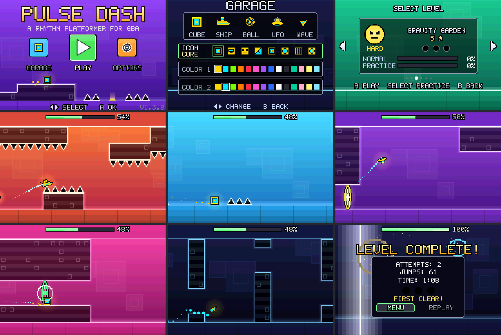

# Pulse Dash on the Game Boy Advance

Pulse Dash on a 16.8 MHz ARM7TDMI without floating point hardware, with
32 KB of fast RAM, 256 KB of slow RAM and a 240x160 tiled screen. Unlike
the Game Boy Color, it runs the game's own code: the menus, the levels,
practice, the results, the title screen's demo, the physics, progress and
saves are the same C files the PC, PS2 and PSP build (`CORE_SRC` in
`sources.mk`). What the GBA has of its own is how the game looks and how
its music comes out. How the code is shared is in [PORTING.md](PORTING.md).



## What is in it

Everything the other versions have, because it is their game code:

- **All six levels** with every vehicle, orb, pad, portal, saw and coin,
  **the same physics, tick for tick** (it runs `src/core/sim.c` itself; the
  emulator test below checks the ROM's player against the reference after
  every tick of every level).
- **Practice mode** with checkpoints, the attempt counter in the world,
  the progress bar, NEW BEST, the pause menu, the finish line and the
  results with their fireworks.
- **The title screen over the game playing itself** (the demo run, on the
  beat of the menu song), **the garage** (the eight icons and the 14
  colours, two to choose, on all five vehicles), **the level select** with
  its cards sliding past, and **the options**: music and effect volumes,
  the output (the music mixed for headphones or for the GBA's speaker),
  the audio delay with its metronome and lights, erasing the progress.
- **The music and sound effects of the other versions**: the game's own
  synthesizer (`src/core/audio.c`) plays every song and effect at build
  time, and the ROM carries the recordings (below), so they sound as they
  do on the PC, chords, supersaws, filters and the ping-pong echo
  included: the songs **in stereo** on the GBA's two Direct Sound
  channels, the effects in mono; and **mixed for the GBA's speaker**
  (OUTPUT: SPEAKER), in mono, the bass it can't play cut, and compressed,
  louder.
- **The look of the other versions**, drawn by their own renderer: the
  blocks, spikes, orbs, portals, vehicles, icons, logo and buttons are
  drawn at build time by the vector renderer the PC uses, at the GBA's
  scale (12 pixels to a block, 34 on the PC), and turned into tiles and
  palettes; what turns (the vehicles, the saws, the orbs' dashes, the
  title's cog) is drawn at each step of its turn, and what has rings or
  outlines thinner than a pixel at this scale (the saws, orbs, coins,
  portals, the ball) is drawn pixel by pixel in the renderer's shapes;
  the text is in the core's own 5x7 font. The background's gradient, the
  level's palette and its changes, the beat lighting the edges, the
  parallax squares, the see-through panels, the finish's flash, scaling
  sprites and added light are done by the hardware.
- **Saves** in the cartridge's battery-backed SRAM, the same `SaveData`
  as on the other platforms (`src/core/save.c`), in two copies written in
  turn: a save cut short (the power going off as a level is finished)
  leaves the one before it.
- Runs at the full frame rate, with no frame late anywhere: the runs, the
  menus and their fades, a level's loading, the pause and the results
  (the emulator test checks every frame).

Not on the Game Boy Advance: the PSP's widescreen; particles beyond 96 at a
time (the PC has 700: the busiest moments, a death or the fireworks, lose
their oldest ones first); sound above 10 kHz (the GBA plays 21 kHz, the PC
48; the speaker's mix 6.7 kHz, at 13 kHz); the title's chosen button pulsing (it is drawn bigger, as a picture
of its own: scaled by the hardware its edges would waver a pixel); and
the music is a recording, so it starts on a frame, not on the sample.

## Playing it

`pulsedash.gba` is made for any Game Boy Advance emulator (mGBA,
NanoBoyAdvance, SkyEmu, ...; so far it has been run in mGBA only, see
**Tested on** below) and for a Game Boy Advance, a Nintendo DS or DS
Lite, or an Analogue Pocket with a flash cartridge that takes 32 MB ROMs (it is 31.4 MB)
and has SRAM (the ROM declares `SRAM_V113` for the cartridges and
emulators that look for it). Its sound is stereo on headphones; on the
console's speaker set OUTPUT to SPEAKER in the options (the speaker plays
little of the bass, which takes most of the headphones' mix's level, and
is mono). CI builds
it on every push (the `pulsedash-gba` artifact), or build it yourself
(below).

| Button | Action |
|--------|--------|
| A / Up / L / R | Jump; hold to fly (ship) or climb (wave) |
| Start | Pause |
| B (practice) | Place a checkpoint |
| Select (practice) | Remove the last checkpoint |
| D-pad, A, B in the menus | Move, choose, back |
| Select in the level select | Play the level in practice mode |

## Building and testing

```sh
scripts/build-gba.sh                         # -> build/gba/pulsedash.gba
build/host/gba_tool audiocheck               # the songs' and sounds' encoding against the synth
make -f Makefile.host build/host/gba_test    # needs libmgba-dev
build/host/gba_test play build/gba/pulsedash.gba   # play every level in mGBA's core (below)
```

`build-gba.sh` needs `arm-none-eabi-gcc` with newlib (Debian/Ubuntu:
`apt-get install gcc-arm-none-eabi libnewlib-arm-none-eabi`), and a C
compiler and SDL2 for the host tool (as for the PC build). The first time
it fetches `gbafix` from devkitPro's gba-tools (a pinned version, checked
against its hash), which writes the cartridge header's logo and checksum;
then `make -f Makefile.gba` builds the ROM. `gba_tool`
(`src/host/gba_tool.c`) makes the ROM's data from the game itself, so a
level, a song or a colour changed in `src/` reaches the GBA with the next
build: the levels and the game's logic are compiled into the ROM as they
are, the graphics and the sound are made by the PC's renderer and synth.
`gba_tool artsheet out.png` and `gba_tool objsheet out.png` draw what it
made of the tiles and sprites.

`gba_test play` boots the ROM in [mGBA](https://mgba.io)'s core (libmgba),
visits the garage, the options and the garage again, then the title and the
level select and plays each level with the solver's presses
(`src/host/solver.c`), fed to the game on the tick they are for, after an
attempt that dies (the presses stopping at tick 1000) and its respawn,
and with a pause a third of the way in; the second half of the levels
with OUTPUT on SPEAKER (the options' OUTPUT changed there and back on the
way). It fails unless the ROM's player
is the reference's (`sim.c`, run beside it) after every tick, the level
is finished, no frame was late anywhere (the menus and their fades, the
levels' loading, the pause and its resume, the results, the restarts),
the run keeps time with its song in every attempt (the song never going
back, and as far ahead of the run's ticks in all of them, a pause or not),
each vertical blank restarted the sound's DMAs where they had read their
buffers to the end (`g_audio_stat`: 6 samples before a frame's end, in
both mixes; the window is from 14 before to 1 after),
no tile of the text layer mixes two palettes on any screen it saw, the
pause menu and the results appear whole (in one frame, not in parts), the
results lead back to the level select, the best is saved, the save is
still there after a restart, and a save cut short leaves the one before
it. `gba_test play <rom> 0,3 DIR` plays levels 0 and 3 and saves pictures
of each level's respawn, start, middle and results in `DIR` (and of the
text layer's whole surface if a tile mixes palettes, of a pause menu or
results shown in parts); it also prints how
many scanlines each level's frames took, and the most a frame took on
each screen. For profiling, `GBA_TEST_LATE=1` lists the late frames,
`GBA_TEST_HEAVY=n` the frames of n scanlines' work or more, and
`GBA_TEST_FRAME_STATE=f` saves the emulator's state before frame f in
`gba_test.state` (and prints the keys pressed from there, as a script
for `gba_test run`). `gba_test run <rom> <frames>
[keys] [shots]` runs the ROM with a script of key presses and saves
screenshots; both read the ROM's ELF file (`build/gba/pulsedash.elf`)
for where the game keeps its state.

## How it works

`src/gba/`:

| File | |
|------|-|
| `main.c` | start-up, the frame loop and the interrupt; the pad as the core's buttons |
| `gba_draw.c` | `game_render()`: each screen of the core's state, as `game_draw.c` draws it on the other platforms |
| `world.c` | the level: its tiles' map streamed into BG1, the ground and corridor bands (BG2), the parallax squares (BG3), the colours, the background gradient and the glow |
| `levels_gba.c` | the levels and the title's run as `gba_tool` parsed them, with their tiles; the title run's snapshots |
| `fx_gba.c` | the particles (`fx.h`), in fixed point |
| `sprites.c` | the player, orbs, pads, portals, coins, saws, checkpoints, the finish line and the particles, as sprites |
| `ui.c` | text and panels: a 512x160 surface drawn in software, packed into tiles (BG0) |
| `menus.c`, `hud.c` | the title, level select, garage and options; the play screen's progress bar, texts, pause menu and results |
| `audio_gba.c` | the `audio.h` API: the recorded songs and effects mixed into the sound FIFOs |
| `video.c` | the frame being prepared: registers, sprites, palettes, per-scanline colours, VRAM copies queued for the vertical blank |
| `save_gba.c`, `sys.c`, `crt0.s`, `gba.ld` | SRAM, the heap, start-up, the memory map |

`src/host/gba_tool.c`, `gba_art.c`, `gba_art_obj.c`, `gba_levels.c` (with
`src/gba/cellmap.c`), `gba_audio.c` make the ROM's data (`build/gba/gen`);
`gba_test.c` is the emulator test.

**The game's code.** The core's game logic (`game.c`, `play.c`, `demo.c`,
`fx.c` and the rest of `CORE_SRC`) runs unchanged, ticked once a frame.
Its drawing went into files of its own (`game_draw.c`, `play_draw.c`,
`demo_draw.c`, `fx_draw.c`, in `VECTOR_SRC`), which the GBA replaces with
its own `game_render()`. Floating point is done in software, and the
hottest of it (libgcc's single-precision routines) and the physics run
from the fast RAM as ARM code. `target.h` asks the core for three things
a CPU without floating point needs: the particles are the GBA's own
(`fx_gba.c`: the core's effects in fixed point, 96 at a time, their sines
from a table); the levels and the title's run are parsed at build time
(`gba_tool`, which also checks that the parse is the core's: a level
loads in a frame); and so are the title run's snapshots, one every block
(picking the run up where the music is replays 6 ticks at most).

**The picture.** Mode 0, four tiled backgrounds and 128 sprites:

- BG1, the blocks and spikes: a block is 12x12 pixels, made of nine 4x4
  quarters. `gba_tool` draws each kind of cell (a block with each
  combination of edges, slabs, spikes) with the PC's renderer at 12 pixels
  a block, cuts it into quarters and puts each level's world together from
  them in 8x8 tiles (`cellmap.c`), each different tile once (60 to 180 a
  level). The level's tiles go into VRAM as it starts; its map streams
  into BG1's 32x32 one as the camera moves (a column or a row of tiles a
  frame; after a jump, a respawn say, all of it, a row at a time).
- BG2, the ground and the corridors' floor and ceiling bands; BG3, the
  squares behind, scrolled at 0.3 of the camera's speed.
- The level's colours are palette entries: the background's gradient and
  the colours mixed with it (see-through blocks, squares, bands, the glow
  around blocks) are set for every scanline by DMA in the horizontal blank
  (ten colours a line, from tables in the fast RAM); the rest once a frame.
  A palette change, the beat on the edges, the ground's glow are colour
  changes, no tile is redrawn.
- The glow around blocks (`render_level`'s: added light, 8 of the PC's 34
  pixels beyond each exposed edge, round the corners where both sides are
  exposed) is the two pixels next to an edge in two colours, the gradient
  with 0.82 and 0.47 of the glow added, line by line. `gba_tool` gives
  each cell a mask of the blocks beside it that glow into it, and its
  tiles take the glow's quarter for that mask where the cell's own
  picture is empty. The slabs' glow inside their own cells,
  and the spikes' (`spike_glow`), are in their pictures. BG1's pixels are
  solid, so on the lines where BG2 shows a corridor's band or its line,
  or the ground line's glow, the two colours are those with the glow
  added instead. The saws' glow is a ring sprite, added by the hardware.
- The player is a sprite in the garage's icon, drawn by the PC's
  `icons.c` at build time at each step of its turn (the cube and the ball
  in 64 a whole turn, the ship and the wave in 33 from straight up to
  straight down, the UFO's tilt in 13), the step of the moment copied into
  VRAM as its angle changes; upside down, the hardware mirrors the step of
  the opposite angle. The PC's lines are 0.7 of a pixel here and the bands
  of colour between them often under 2 pixels: drawn and brought down,
  each would be there or not by where it falls, and come and go as the
  vehicle turns (the upright cube's inner border was never there). So
  each vehicle has a design: the PC's picture drawn again with the corners
  of what it draws moved (`gfx_sdl_warp`) so that its straight edges are
  on whole pixels and every line and band of colour is a pixel or more, as
  nested squares are drawn by hand. Where there aren't the pixels for all
  of them, the kind of band whose loss costs the picture least is left
  out: the cyan inside STRIPE's dark bars in a run, and inside VISOR's
  mouth, which is a dark line. The upright step (and the cube's quarter
  turns, the same however it lands) is that design; the other steps are a
  second one, its edges left nearer the PC's and its slanted lines
  widened to a pixel, turned, each pixel the part at its middle: a line a
  pixel wide can't pass between the middles of two pixels next to each
  other, so it shows at every step. The lines come out a little heavier
  than the PC's (the wave's outline most). The small cubes riding in the
  ship and the UFO are made on their own, 6 or 7 pixels across with a
  pixel of outline (in a run the UFO's is a pixel wider than the PC's, so
  that it sits on the UFO's middle), the inside each pixel the colour
  most of it is: they keep their outline and colours at every step, but
  not their finer lines (SPLIT's diagonal). The ball is drawn pixel by
  pixel (its rings are half a pixel at this size). Its two colours are
  palette entries. The garage shows the vehicles bigger, as the PC's does
  (44 pixels a block there, 34 in a run).
- Orbs, pads, portals, coins, saws and the finish line are sprites in
  `render.c`'s shapes, drawn at build time. The PC's 2-pixel lines are
  0.7 of a pixel here: drawn and brought down they come out broken or as
  a smear of in-between colours, so what has them (saws, orbs, coins,
  portals, the speed portals, the checkpoint, the title's cog) is drawn
  pixel by pixel: a shape fills the pixels it covers the most of, an
  outline is the shape's own edge pixels, a ring the pixels whose middles
  are within half a pixel of its radius. The saws and the orbs' dashes
  turn in steps, as the player does; the orbs swell with the beat and the
  coins spin by the sprites' matrices. Added light (particles, the finish
  line) is hardware blending.
- The finish's flash (`play_draw`'s white over the world, not the HUD)
  is added to the world's and the objects' colours, in the palettes and
  the per-scanline tables, as the screen's fades are.
- The camera is kept a whole number of pixels from the player, so that
  it stands still on the screen as it runs, as on the PC. Past the finish,
  as it glides to a stop and the player speeds off, it is kept a whole
  number of pixels from where it stops instead, and is there once less
  than a pixel from it: rounded on its own (or from the player) its last
  pixel's step could come half a second after it seemed to have stopped.
- The glows around the player, orbs, pads, portals and coins (the PC's
  `draw_glow`) are see-through sprites the hardware adds to what is behind
  them: a disc (a column for the pads) in five rings, brighter inwards,
  scaled to each glow's size and coloured by the last five entries of the
  object's palette (its picture keeps to the other ten); the player's
  pulse with the beat, as on the PC. They are put after every other
  sprite, so that the objects and the HUD are drawn over them. They stay
  through a fade between screens (it scales every palette, theirs too, so
  they darken with the rest), but not under the pause menu: its panel
  darkens what is behind it by the hardware's effect, which leaves out
  sprites that add their light.
- The title's logo bobs 2 pixels up and down a pixel at a time, a step
  every 0.39 seconds (an eighth of the PC's bob): a sprite moves by whole
  pixels only, and the PC's sine in them came in steps of uneven length.
- The title's control hint is centred on the version's line, in the
  ground under the demo's run, as on the PC: there it covers none of the
  run, which comes down to the ground's line (under the line only the
  player's glow reaches, see-through, a few pixels into the hint's first
  letter). It is outlined, so that its pulse stays readable over every
  level's ground. The version has the rest of the line, room for 10
  letters: a tag as it is (`v1.2.0`), a build past a tag by its commit as
  the Game Boy Color's title shows it (`v1.2.0-1-g354117c` as `354117c`),
  with a `*` for changed files (`-dirty`); a tag too long even then loses
  its `v`, then its end, marked by a `+`.
- BG0 is text and panels, drawn into a 512x160 surface in software in the
  core's font and packed into tiles (a tile of one colour shared by all
  the cells like it, any other cell a tile of its own), only where it
  changed. A screen's text is drawn a part at a time (a card, a line of a
  panel), as the frame has time for it: a screen opening under its
  fade-in fills in over its first frames. The pause menu and the results,
  which open over the run with no fade, take three frames or four to
  draw and pack (the pause menu 280 scanlines to draw, 170 to pack):
  they are drawn out of sight, BG0's copies to VRAM held back while the
  screen goes on showing the run, stopped, and shown whole in one frame
  (the pause menu with its darkening), the one that packs their last
  cells; so is a move of their choice. The surface is emptied lazily
  (a cell when something is next drawn into it), and a panel's inside is
  not drawn at all but shown as the tile of its one colour. The level
  select's cards are drawn into its two halves, once each, and slide by
  scrolling BG0; texts that grow (NEW BEST, LEVEL COMPLETE) are sprites. See-through panels darken what is behind them
  through a window; the fade between screens is done in the palettes, so
  that they stay darker than what is around them as it fades. A tile
  shows one palette of 16 colours, so text in other colours keeps to
  tiles of its own (the emulator test checks every screen for a tile
  that mixes two).

**The sound.** `gba_tool` plays every song and sound effect with the
game's synthesizer, the PC's, resamples it to 21,120 Hz and stores it as
8-bit samples, the GBA's own: the songs in stereo, 22 MB in all, rounded
with their noise shaped up and away from the music; the sound effects in
mono, stored up to 8 times louder (they are quiet) and made quieter again
as they are mixed. Nothing is decoded: in the vertical blank's interrupt
the ROM mixes 352 samples a frame of each side (one frame of sound), adds
up to four sound effects and applies the volumes, and DMA feeds the left
side to Direct Sound A and the right to Direct Sound B. At the default
volume with no effect playing the music is copied as stored, four
samples a word; a sum past 8 bits (a volume over 8, effects over loud
music) is bent into them (a soft clip from 100 of 127), not cut off,
which crackled. Songs loop by jumping back in the recording, with a short
crossfade. The audio delay option shifts the song's position.

Each song and effect is stored a second time **mixed for the speaker**
(OUTPUT: SPEAKER, `save.speaker`): the GBA's speaker is small and mono, plays
next to nothing below a few hundred Hz, and the bass takes most of the
headphones' mix's level, so through it that mix is quiet, and what the
speaker does play is coarse in 8 bits. The speaker's mix is mono, its bass
cut below 300 Hz (a 4th-order high-pass), compressed (3:1 above the song's
own average level) to 13 dB under full scale, limited (a look-ahead
limiter) to 120 of 127, 14 dB louder than the headphones' mix on average,
and rounded to 8 bits at 13,440 Hz (224 samples a frame: the cartridge has
room for 7 MB of it, not 11; the speaker plays little above its 6.7 kHz;
without noise shaping, which at this rate would lift the noise where the
speaker plays best). The effects get the same high-pass and the songs'
gain. The ROM then plays at 13,379 Hz, from one buffer on both channels.

The output (`audio_gba.c`): Timer 0 plays a sample from each FIFO every 798
cycles (the speaker's mix: 1254), exactly 352 (224) a frame, and DMA 1 and 2
refill the FIFOs 16 bytes at a time from the buffers. The timer is started
once, at the start of a scanline, and never stopped: a frame being a whole
number of samples, it keeps its place against the picture, and so do the
DMAs' requests, one every 16 samples, so that each vertical blank comes
between two of them (6,000 cycles from each; the speaker's mix 10,000),
where the DMAs have read the last buffers exactly to their end: the
interrupt points them at the next ones, and the FIFOs play on from the old
buffers' last 23 samples into the new ones. This is how Nintendo's and
Maxmod's mixers do it; the ROM first restarted the timer and emptied the
FIFOs at each vertical blank instead, which made the sound depend on when
the interrupt came and on what emptying a FIFO does to the sample being
played, which the hardware doesn't document (it crackled, and hummed in
the pause menu's silence, on a GBA). Silence is a buffer of zeros in the
fast RAM, like the others (the DMAs never read the cartridge). The output
is 8 bits at 65,536 Hz (`SOUNDBIAS`; the BIOS's 9 bits at 32,768 Hz add
nothing to 8-bit samples, and the finer grid shifts them less), the bias
set to the middle in case a loader left it elsewhere. Changing OUTPUT
fades the sound out, plays a frame of silence, restarts the output at the
mix's rate and fades back in where the song was (3 frames).

If the songs ever outgrow the cartridge (30 MB for both mixes),
`gba_tool` stores the headphones' mix in mono.

**The frame.** The interrupt at each vertical blank shows the frame
prepared since the last one (registers, palettes, sprites, the tiles and
maps queued for VRAM) and mixes the next frame's sound; then the main loop
reads the pad, ticks the game and prepares the next frame. What can wait
is done while the frame has time left (`frame_lines_left()`, from the
scanline it is at): packing text into tiles, a screen's text a part at a
time (each when the frame has the time it takes: 80 scanlines for the
pause menu's panel, up to 45 for a line or an item, 40 to 65 for a row
of the garage or the options, with the frame's work after it 140 in all,
and while the garage opens one row a frame; the title's texts, 65 each,
after the run behind them), a text sprite
(ATTEMPT n, NEW BEST) on a frame that has the time; the rest waits for
the next frames, held out of sight where it would show in parts (the
pause menu, the results). A frame that ran long would be
caught up with extra ticks, as the PC does, except where a song begins:
it begins as the picture of the tick that started it is shown, however
long that frame took, and the run goes on from there with it, without
catching up.

## The CPU budget

A frame is 228 scanlines (160 shown, 68 of vertical blank), about 280,000
clock cycles. Scanlines a frame's work takes (the tick and the drawing,
not the sound in the interrupt), mean / most, playing each level through
(`gba_test play`):

| Level | 0 | 1 | 2 | 3 | 4 | 5 |
|-------|---|---|---|---|---|---|
| a frame's work | 59 / 172 | 60 / 161 | 59 / 164 | 61 / 169 | 63 / 171 | 61 / 163 |

(The most comes as a level is finished: its flash, LEVEL COMPLETE and
the fireworks.) The most any frame took
in the whole test, by screen: the title 183, the level select 188, play
190 (a death, a respawn, the pause, the results), the garage 191, the
options 192. The busiest are a screen's first frames,
which draw its text for as long as the frame has time (the garage's
rows one a frame as it opens: a row takes about 60 scanlines there, and
its first frame also empties the surface and draws the world behind
anew). No frame runs long. The vertical blank's interrupt (showing the
frame, mixing the sound) takes 4 to 10 scanlines a frame, and at most
54 in the test's hardest case for the mixer: both volumes at 10, sound
effects overlapping and songs changing in the options (fades); `gba_test`
plays half the levels at volume 10 too.

What it took to fit:

- Software floating point everywhere the core uses floats: libgcc's
  routines, the physics and the particles are ARM code in the fast RAM.
  The core's integer physics costs little; the floats around it (the
  camera, the effects, the drawing) are most of a frame's work.
- Done at build time rather than in the frame: the levels parsed and
  drawn into tiles, the title run's snapshots, sine tables (`sinf` in
  software takes thousands of cycles for a large angle).
- The particles in fixed point (a float operation is a call of 60 to 100
  cycles).
- Nothing drawn twice: tiles stream in as they come into view, text is
  drawn when it changes, the level select's cards when they come into
  view, and a menu row when its state changes.
- What can wait waits: a screen's text and the packing of it into tiles
  are done while the frame has time left, the rest in the next frames.
- A layer's whole map (a level's start, a respawn) is written a row at a
  time from the fast RAM; a screen's text is emptied lazily; a panel's
  inside is one tile of one colour, never drawn.
- The loops the compiler would make calls to newlib's `memset` (a slow one,
  from the cartridge) are kept as loops; text is written four pixels at a
  time.
- In the shared code: the level parser measured each line once per column
  (now once per section), and the title demo's button lookup compared
  floats (now the same comparison in the player's fixed point); a
  palette's blend is skipped at its ends (the run's palette is one most of
  the time: it took 10 scanlines a frame), and the camera's ease for a tick
  is worked out once (`expf`); all give the same results as before on
  every platform.
- Once a frame rather than three times: the beat's pulse (`beat_pulse`).
  The wave's trail is sized in integers.
- The mixer: the sound effects' volume applied to their sum, then an add a
  side at the default music volume (a sound effect took 15 scanlines of
  the interrupt), and the fades' frames in ARM code in the fast RAM, out
  of the cartridge (they took 18). The sprite attributes moved to the slow
  RAM to make room (half a scanline a frame to copy).

ROM: 31.4 MB of a cartridge's 32: 29.5 MB of sound (the headphones' mix
22.3, the speaker's 7.2), about 90 KB of code, and the graphics and the
levels. Fast RAM (IWRAM): 27.9 of the 28 KB beside the stacks (24 bytes
free) (the ARM code, the sound buffers, the per-scanline colours). Slow RAM (EWRAM): 205 KB of 256 for the text
surface, tile and map copies, the title run's snapshots and tables (the
levels are read from the cartridge). SRAM: the save, twice.

The Game Boy Advance draws 59.73 frames a second, not 60, and the game
ticks once per frame, so the game and its music run 0.45% slower than on
the other versions, in step with each other.

## What the platform allows, honestly

**Possible, and done:** the whole game, from the same code, with its
music as the synth plays it and its graphics as the PC's renderer draws
them, at full frame rate. That it runs the core unchanged is what makes
it cheap to keep: a level, a rule or a menu changed for the PC is changed
for the GBA.

**The limits:**

- *CPU.* No floating point unit: every `float` the core uses is a call of
  60 to 100 cycles. The game's frames take a third of the CPU on average
  and up to 85% in the busiest spots; more particles, more objects on
  screen or effects drawn per pixel would not fit without moving more of
  the core to fixed point, which the other platforms would then share.
- *Graphics.* 240x160, 4-bit tiles with 16 palettes of 16 colours, 128
  sprites (32 of them rotated or scaled), no per-pixel transparency
  except blending between layers. The PC's look carries over in its
  shapes, colours and effects, at a lower resolution; the outlines are a
  pixel wide, the glows are coarser.
- *Sound.* The synth can't run live (it would take several times the CPU),
  so the songs are recordings: 22 MB of the ROM, in stereo, at 21 kHz and
  8 bits, which is what the GBA's output plays, and 7 MB more in the
  speaker's mix. The cartridge has room for little more: one more level's
  song would have the headphones' mix stored in mono.

**Tested on:** mGBA (libmgba 0.10.2), in which the emulator test plays
every level; and earlier builds once on a Game Boy Advance with an
EZ-Flash Omega, whose findings (the player shaking a pixel, the title's
bob stuttering, the sound crackling and humming, the pause menu appearing
in parts, and more) are fixed here, this build not yet tried on it. Not
in the most accurate emulators (NanoBoyAdvance); the game relies on the
vertical blank interrupt, horizontal blank DMA for the gradient and DMA
to the sound FIFOs, as Nintendo's own mixer does it. Its VRAM writes are queued for the vertical blank (a
level's tiles as it starts, the maps as the camera moves), except the
particle rings' sprite tiles (two sets, in turn), written during the
frame into the set that is not on screen.
