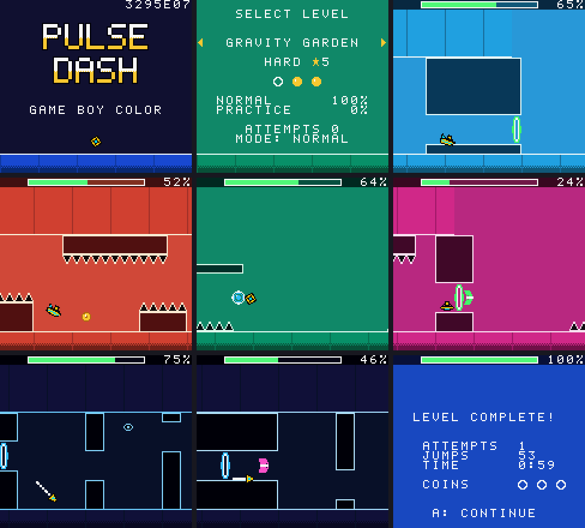

# Pulse Dash on the Game Boy Color

A demo of how much of Pulse Dash a Game Boy Color can play: the core game,
the same physics to the tick, on an 8-bit CPU at 8.4 MHz (the Color's
double-speed mode) with 32 KB of RAM.



## What is in it

- **All six levels**, start to finish, with every vehicle (cube, ship, ball,
  UFO, wave), the gravity and speed portals, yellow/pink/blue/green orbs,
  yellow/pink/blue pads (on floors and ceilings), spikes, saws and the three
  secret coins of each level.
- **The same physics as the other versions**: a fixed-point port of
  `src/core/sim.c` (4 sub-steps per 1/60 s tick, 16.16 positions, even the
  float32 rounding of x reproduced) that `gbc_tool` checks every level
  against, so a press lands where it lands on the PC, to the tick.
- **Each level's song**, arranged for the four sound channels (lead or arp
  on the two pulse channels, bass on the wave channel, drums on the noise
  channel), in time with the level, plus sound effects.
- **The level's palette changes**, blended over 0.8 s, and the beat flashing
  the block edges and the ground line.
- **Practice mode** with checkpoints, the attempt counter, the progress bar
  and percentage, "new best", pause menu and the results screen.
- **Title screen and level select** (difficulty, stars, coins, best normal
  and practice percentages, attempts).
- **Saves** in the cartridge's battery RAM: best percentages, coins,
  attempts.
- Runs at the Game Boy's full frame rate: no frame of any level runs late
  (checked in an emulator, below).

Not in this demo: the garage (one cube design), Options (audio delay), the
live title screen loop, obstacles pulsing with the music (only the edges
flash), the synth's echo, supersaws and filters, the PSP's widescreen. On an
original Game Boy or Game Boy Pocket the cartridge shows a message instead
(the game needs the Color's speed, palettes and second video bank).

## Playing it

Any Game Boy Color emulator runs `pulsedash.gbc` (SameBoy, Gambatte/
GameBoy Online, mGBA, BGB, Emulicious, ...), as does a Game Boy Color, Game
Boy Advance or Analogue Pocket with a flash cartridge that has save RAM.
CI builds it on every push (the `pulsedash-gbc` artifact), or build it
yourself (below).

| Button | Action |
|--------|--------|
| A / Up | Jump; hold to fly (ship) or climb (wave) |
| Start | Pause (A resume, Select restart, B quit) |
| B (practice) | Place checkpoint |
| Select (practice) | Remove last checkpoint |
| Left / Right, Select, A, B in the level select | Level, practice on/off, play, back |

## Building and testing

```sh
scripts/build-gbc.sh                  # -> build/gbc/pulsedash.gbc
scripts/build-gbc.sh PERF=1           # -> build/gbc-perf/pulsedash.gbc, times each frame's parts
build/host/gbc_tool solve             # every level beatable with the Game Boy's physics
build/host/gbc_tool rhythm            # ... pressing only on the 8th notes, 2 ticks early or late
pip install pyboy
python3 scripts/gbc-emu-test.py       # play all six levels in PyBoy (below)
```

`build-gbc.sh` needs SDCC 4.2 (`apt-get install sdcc`), a C compiler and
SDL2 for the host tools (as for the PC build). It builds
[GBDK-2020](https://github.com/gbdk-2020/gbdk-2020) 4.1.1 from source into
`build/gbdk` the first time, or uses `GBDK_HOME` if set; then
`make -f Makefile.gbc` builds the ROM. `gbc_tool` (`src/host/gbc_tool.c`)
turns the game's own levels, songs, font and colours into the ROM's data
(`build/gbc/gen`), so a level changed in `src/levels/` reaches the Game Boy
with the next build. `gbc_tool view <level> <x> out.png` draws the screen
the Game Boy shows at a level position.

`scripts/gbc-emu-test.py` boots the ROM in [PyBoy](https://github.com/Baekalfen/PyBoy),
goes through the title screen and level select and plays each level with
the solver's presses, fed to the game exactly on the tick they are for. It
fails unless every level finishes on the same tick as the host build of
the physics, and unless every frame was done in time. `--shots DIR --every
N` saves screenshots, `--delay N` starts the levels N frames later (work
done every other or every fourth frame then falls on other ticks),
`--perf` plays the `PERF=1` build and prints how many scanlines each part
of the frames took, `--perf-csv` every frame's.

## How it works

`src/gbc/`:

| File | |
|------|-|
| `gbsim.c` | the physics, in a ROM bank of its own; also compiled into `gbc_tool` |
| `gbcells.c` | the 8 columns around the player copied out of the level's ROM bank, with bit masks of their solid, block and object rows |
| `play.c`, `play_ui.c` | a level: camera, background streaming, sprites, death and respawn, practice, the progress bar, pause and results |
| `video.c`, `palette.c` | VRAM queues filled during the frame and written in the vertical blank; palettes |
| `music.c` | the song and sound effect player |
| `menu.c`, `save.c`, `main.c` | title, level select, saves, start-up |

**Levels** are stored one byte per cell, the cell's background tile,
column by column, 16 rows high, about 10 KB a level, each in a ROM bank of
its own. A block is 8x8 pixels (34 on the PC): the screen is 20 blocks wide
(18.8 on the PC) and 15 high, so a level is seen much as on the PC. The
camera doesn't move vertically; the six levels fit in the 15 rows. The
background map (32 tiles wide) is filled column by column ahead of the
camera; the top row, the progress bar, is kept still by changing the
horizontal scroll in an interrupt below it. Corridor ceilings for the
ship, ball, UFO and wave are drawn into the level data by `gbc_tool`.

**The player** is a 16x16 sprite. The Game Boy can't rotate sprites, so
the cube has 6 pre-rotated frames per quarter turn, the ship 7 tilts, the
ball 4, the UFO and wave 3 each; trails, particles, the orb ring and
checkpoints are sprites too.

**The physics** runs four sub-steps per tick like the original. Each
sub-step moves the player, lands on or bumps into solid cells, checks the
inner hitbox and touches objects (hazards, orbs, pads, portals, coins). A
broad phase per tick skips all cell tests when nothing solid or touchable
is within reach. x is kept as the float version's float32 would hold it
(rounded to 24 significant bits after each step); without that, the
levels' tightest spots (cleared by a thousandth of a block) would differ.
`gbc_tool solve` (a search over press/release sequences) and `rhythm`
(only presses on 8th notes, ±2 ticks) prove the levels beatable with this
code, and the emulator test plays the solver's solutions in the ROM.

**The music** comes from the same note data as the synth
(`src/core/songs.c`): `gbc_tool` arranges each song's tracks onto the
channels (chords to their top note, the pad where the lead rests) as byte
streams the player reads once per tick.

## The CPU budget

A frame is 154 scanlines, about 140,000 clock cycles in double-speed mode,
which SDCC's code spends on roughly 14,000 instructions. In the busiest
spots (the cube on a row of blocks next to spikes and a portal) the four
sub-steps of a tick take up to 115 scanlines; 42 on average. What it took
to fit:

- 16.16 numbers handled as 16-bit halves (SDCC's 32-bit compares and
  shifts are long), globals instead of locals (SDCC spills locals to the
  stack), 8-bit loops that visit only the set bits of a column's row mask.
- The helpers called most, in assembly: the box edges, the cell
  distances, the row masks (`gbsim.c`); stepping and packing the palettes
  during a palette change (`palette.c`), which took 65 scanlines in C.
- Objects next to the player's cells are only tested if they can reach
  out of their cell (a big saw, an orb, a portal).
- Each frame runs the music first and the physics next; then the
  columns coming into view, the progress bar and the palettes are only
  done if their longest run still fits before the next frame, else a frame
  later (columns are drawn one ahead of the screen for this).

Scanlines per frame, mean / worst, playing each level through (counted
in cycles by PyBoy):

| Level | 0 | 1 | 2 | 3 | 4 | 5 |
|-------|---|---|---|---|---|---|
| physics | 40 / 106 | 40 / 106 | 42 / 113 | 42 / 115 | 44 / 110 | 43 / 111 |
| the frame's work | 72 / 137 | 72 / 137 | 74 / 143 | 75 / 146 | 80 / 142 | 77 / 145 |

So the busiest frames leave under a tenth of the frame; what can wait
then waits. With `PERF=1` the ROM times the parts of each frame itself
(`scripts/gbc-emu-test.py --perf`); its timers add 10-25 scanlines.

ROM: 256 KB (MBC5, 16 banks), ~150 KB used: 15 KB code and tables in bank
0, the physics in one bank, menus and palettes in another, the tiles in
one, a level in each of six, the songs in two. RAM: 2 KB of the 32 KB.
Battery RAM: the save (under 100 bytes).

The Game Boy draws 59.73 frames a second, not 60, and the game ticks once
per frame, so everything, music included, runs 0.45% slower than on the
other versions; the music stays in time with the level.

## What the platform allows, honestly

**Possible, and done:** the game itself. The levels, vehicles, objects and
timing windows are the original's, run at full frame rate with the music
in sync. That was not a given: the physics is tested at 4 sub-steps per
tick with exact rounding, and a straightforward C port of it took 1.5
frames in busy spots. It fits because the levels are made of grid cells
and most of the work can be skipped or done with 8 and 16-bit numbers.

**The limits:**

- *CPU.* Even optimized, the worst ticks use three quarters of a frame for
  the physics alone. Denser levels (more objects within a block or two of
  the player), rotated hitboxes, more sub-steps or a second player
  wouldn't fit without rewriting the physics in assembly. Unusual objects
  (moving blocks, triggers that move parts of the level) would be hard:
  the level is a static grid in ROM.
- *Graphics.* 160x144, an 8x8 tile grid, 4 colours per tile from 8
  palettes, no rotation, scaling or transparency, 10 sprites per line. The
  PC version's look, glowing outlines, pulsing shapes, smooth rotation,
  particles, a parallax background, doesn't carry over; the demo shows the
  same level geometry in flat tiles. A hand-drawn art pass (tiles made for
  8x8, not converted) would do more for the look than any effect.
- *Sound.* Two pulse channels, one 4-bit wave, one noise: the songs keep
  their melody, bass line and drums, but lose the chords, supersaws,
  filters and echo. A dedicated Game Boy arrangement would sound better
  than the automatic one.
- *Vertical space.* No vertical scrolling: levels must fit in 15 rows.
  Adding a vertical camera is possible (the map is 32 rows) but costs
  more streaming per frame.

**Not limits:** ROM and RAM. A level is 10 KB uncompressed and MBC5
cartridges go up to 8 MB, so many more levels would fit; the game uses 2
KB of RAM.

**Not tested yet:** real hardware and the most accurate emulators
(SameBoy, Gambatte). The frame timing was measured in PyBoy, which counts
instruction cycles; the game doesn't rely on mid-scanline tricks beyond a
scroll change at line 8, so it should behave the same.
