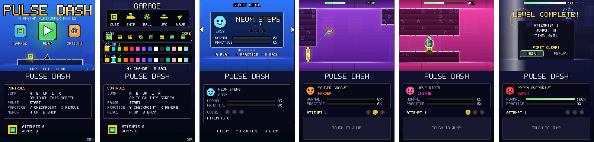

# Pulse Dash on the Nintendo DS

Pulse Dash on a 67 MHz ARM946E-S without floating point hardware, with
4 MB of RAM, two 256x192 screens and a 3D engine that draws up to 2048
polygons a frame. Like the Game Boy Advance version it runs the game's
own code (`CORE_SRC` in `sources.mk`: the menus, the levels, practice,
the results, the title screen's demo, the physics, progress and saves);
unlike it, it also runs the vector family's drawing (`VECTOR_SRC`, the
renderer the PC, PS2 and PSP draw with), its triangles drawn by the DS's
3D engine. How the code is shared is in [PORTING.md](PORTING.md).



## What is in it

- **All six levels** with every vehicle, orb, pad, portal, saw and coin,
  **the same physics, tick for tick** (`src/core/sim.c` itself: the
  emulator test below checks the ROM's player against the reference after
  every tick of every level).
- **The game as the PC draws it**, by the same renderer: the title over
  its demo run, the garage, the level select, the options (with OUTPUT and
  the audio delay), practice, the pause menu, the results and their
  fireworks, the palette changes, the beat on the edges, the glows. The
  top screen shows the virtual screen at 192/448 of its size, 597 virtual
  pixels across (the screen's shape), so the levels show what the PS2's
  640 show, less a 14th; text, icons and outlines land on whole pixels
  (the pixel grid of `draw.h`), and the help texts name the DS's buttons.
- **The bottom screen**: the controls in the menus; the chosen level's
  name, difficulty, bests, coins and attempts in the level select; in a
  run, the level, its bests, the attempt (or the practice checkpoints),
  the coins of this run, and room to touch: **the touch screen jumps**.
- **The music and sound effects of the other versions**: the game's
  synthesizer plays every song and effect at build time and the ROM
  carries the recordings, in stereo, twice: as mixed for headphones and as
  mixed for the DS's own small speakers (the options' OUTPUT: the bass
  they can't play cut, compressed, louder), the synth's two mixes.
- **Saves** in `PULSEDASH.DAT` next to the ROM on the flash card's (or the
  DSi's) SD card, the same `SaveData` as on the other versions.
- Runs at the full frame rate: in melonDS no frame of a level is late,
  nor of the menus (the emulator test checks).
- On a DSi or 3DS that runs it as a DSi game (TWiLight Menu++), the ARM9
  runs at 133 MHz, twice the DS's.

Not on the DS: added light (the 3D engine only blends; glows and sparks
are drawn see-through, close on the dark backgrounds they mostly show
on); particles beyond 160 at a time (the PC has 700); the level's glow
fans and circles are cut into fewer segments (as many as the screen's
pixels show).

## Playing it

`pulsedash.nds` runs on a Nintendo DS, DS Lite, DSi or 3DS from a flash
card (an R4 or similar: copy it to its memory card), on a DSi or 3DS with
TWiLight Menu++, and in melonDS (no BIOS needed). It is a 74 MB ROM: the
music is most of it. Saves need a file system, so they work on flash
cards and the DSi's SD card; in melonDS, give homebrew an SD card (its
DLDI option) for them, or play without saving. CI builds it on every push
(the `pulsedash-nds` artifact), or build it yourself (below).

| Button | Action |
|--------|--------|
| A / B / Up / L / R, or touching the bottom screen | Jump; hold to fly (ship) or climb (wave) |
| Start | Pause |
| Y (practice) | Place a checkpoint |
| X (practice) | Remove the last checkpoint |
| D-pad, A, B in the menus | Move, choose, back |
| Y in the level select | Play the level in practice mode |

(The game's buttons are the PlayStation's: A is its ✕, B its ○, Y its □
and X its △; the help texts name them by letter.)

## Building and testing

```sh
scripts/build-nds.sh         # -> build/nds/pulsedash.nds (needs Docker and a C compiler)
scripts/nds-emu-test.sh      # play every level in melonDS (below)
```

`build-nds.sh` first builds `nds_tool` on the PC (`src/host/nds_tool.c`,
`nds_audio.c`: the game's synthesizer), which records the songs and sound
effects into `build/nds/nitrofs` (the ROM's file system) and writes the
songs' table (`build/nds/gen`), then builds the ROM with BlocksDS in its
Docker image (`skylyrac/blocksds`, a pinned version; or with a local
BlocksDS when `BLOCKSDS` is set): `make -f Makefile.nds`. The menu's icon
(`src/nds/icon.png`) is drawn by the game: `make -f Makefile.host
nds-art` redraws it. `make -f Makefile.host NDS=1` builds the PC version
in the DS's layout (in `build/host-nds`), to look at its screens:
`build/host-nds/pd_tool menu options out.png 1 256`.

`nds-emu-test.sh` builds melonDS's libretro core (a pinned commit, into
`build/melonds`, the first time) and runs `nds_test play`
(`src/host/nds_test.c`), which loads it, boots the ROM directly with
melonDS's FreeBIOS, visits the garage and the options, then plays each
level from the menus with the solver's presses (`src/host/solver.c`), with
a pause a third of the way in, and fails unless the ROM's player is the
reference's (`sim.c`, run beside it) after every tick, the level is
finished, no frame of the menus or of a run is late, the run keeps time
with its song (the song as heard against the run's ticks, all through it
and across the pause), the song is heard (melonDS's sound out), the 3D
engine is never asked for more polygons than it draws, the results come
and lead back to the level select, and the best is 100%. `nds_test play
<core> <rom> 0,3 DIR` plays levels 0 and 3 and saves pictures of each
level's start, middle and results in DIR; `nds_test run <core> <rom>
<frames> [script] [shots]` runs the ROM with a script of key presses. The
ROM's ELF beside it tells the test where the game keeps its state
(`g_test_info`, `src/nds/main_nds.c`).

## How it works

`src/nds/`:

| File | |
|------|-|
| `main_nds.c` | start-up, the frame loop, the pad and touch screen as the core's buttons, the frames' timings |
| `gfx_nds.c` | `gfx.h` on the 3D engine: triangles, quads, rectangles, glows, glyphs and their outlines |
| `audio_nds.c` | the `audio.h` API: the recorded songs read from the ROM, decoded into the sound channels' ring; the sound effects |
| `bottom_nds.c`, `soft_nds.c` | the bottom screen: what it shows, and `gfx.h` drawn by the CPU into its bitmap |
| `save_nds.c` | the save file |
| `fastmath.c` | `sinf`, `cosf`, `expf` and `sqrtf` for a CPU without floating point |
| `target.h` | the DS as the core sees it |

**The frame.** The DS shows 59.83 frames a second and the game ticks once
a frame, as on the Game Boy Advance, so every frame moves the same; the
game and its music run 0.29% slower than on the other versions, in step
(the songs are recorded so). Each frame the loop reads the pad, ticks,
draws (the 3D engine takes the frame's polygons at the vertical blank and
draws them as the next frame is shown), writes the sound ahead and gives
what time is left to the bottom screen. A frame that runs late is caught
up with an extra tick: the picture stays a frame longer, the game and the
music keep step.

**The picture.** The 3D engine draws the virtual screen through an
orthographic projection, a vertex in 1/16 of a pixel. It is no painter:
it draws the opaque polygons of a frame before the see-through ones and
keeps a depth buffer, so each primitive gets a depth nearer than the one
before, and the see-through ones are drawn in the order they come: what is
drawn later is in front, as the core expects. Its alpha is one per
polygon, so a primitive whose corners differ in alpha (a glow fading
out) is drawn with a texture of an alpha ramp, the alphas given as its
coordinates. A see-through pixel is not drawn over one of the same
polygon ID, so the triangles of a shape (a run of primitives in the same
colours) share an ID and blend once where their edges meet. Glows are a
square of a radial texture (the PSP's `GFX_GLOW`). Text comes from the
font as whole glyphs (`GFX_DEVICE_RECTS`, below), each a square of a
2-bit texture of the font with colour 0 see-through (opaque text stays an
opaque polygon), its outline another texture of every glyph's ring at
that size, made at start-up for the sizes the game draws. A level's frame
has 400 to 900 polygons of the engine's 2048.

**The bottom screen.** The sub engine shows a 16-bit bitmap the CPU
draws, with the core's own text, panels, icons and coins: `gfx_nds.c`
sends the primitives to `soft_nds.c` while it is drawn. It is drawn only
when what it shows changes (a screen, a level, an attempt, a coin): the
parts that don't change in a run once a level, the rest over a copy of
them. The drawing is queued, done in the time the frames leave over, into
a copy in RAM, and copied to the screen by DMA at the vertical blank once
it is whole.

**The sound.** `nds_tool` plays every song and sound effect with the
game's synthesizer (the PC's), resamples it to the DS's 32728.5 Hz (a
sound channel's timer at 512), 547.06 samples a tick of song time, and
stores the songs as 8-bit samples in groups of 32 that share a shift
(block floating point: 43 dB and more above the error; IMA-ADPCM's 4 bits
gave 27 on average, 18 in the busiest parts), in blocks of 1024 samples a
side, 34 MB for each mix. The ARM9 reads the blocks from the ROM's file
system (NitroFS) as the song plays: a song's first blocks are kept in
memory from the start, so it starts at once; the rest is read a block or
two at a time (0.7 ms a block in melonDS), up to 3.7 seconds ahead, in
frames with time for it, and in a busy one only what is needed soon. It
decodes them into a ring of 8192 16-bit samples a side that two of the
sound hardware's channels play round and round, panned left and right,
written 2048 samples (62 ms) ahead of where they play: two of the ARM9's
timers count the samples at the channels' own rate. Songs loop as the
sequencer loops them (the jump crossfaded over 256 samples recorded past
it); a change (a song, the pause, the output, the volume, the audio
delay) is written from 4 ms ahead of where the channels play. The sound
effects are 8-bit samples in memory, both mixes (680 KB), each played by
a channel of its own.

**Saves.** `PULSEDASH.DAT` next to the ROM (FAT, through the flash card's
DLDI driver or the DSi's SD slot), written to `PULSEDASH.TMP` first and
renamed, so a battery running out mid-write leaves a whole save; the music
is written as far ahead as the ring holds first, so it plays on through
the write.

## The CPU budget

A frame is 560,190 cycles of the 33.5 MHz bus, 1.12 million of the ARM9.
The game's work in a frame (the tick, the drawing, the sound; the bottom
screen takes what is left), mean / most, playing each level through in
melonDS (`nds_test play`):

| Level | 0 | 1 | 2 | 3 | 4 | 5 |
|-------|---|---|---|---|---|---|
| a frame's work, % of a frame | 34 / 70 | 38 / 81 | 41 / 82 | 45 / 92 | 50 / 86 | 48 / 90 |

melonDS's ARM9 timing is an approximation (its caches always hit, a data
access in main RAM taking 3 cycles); the hardware may take more or less.
A DSi runs the game at twice the speed.

What it took to fit (the vector family's renderer and the game's logic
use floats throughout, and every float operation is a call of 30 to 100
cycles; the first build drew the title screen in 4 frames):

- libgcc's single-precision routines, the backend, the font, the shapes
  and the music's decoding run from the ITCM, the ARM9's 32 KB of memory
  that fetches an instruction a cycle.
- `sinf`, `cosf` and `expf` of the C library work in double precision:
  the DS's are a table and a polynomial, in integers where they can be;
  `sqrtf` is the ARM9's square root unit (exact).
- Coordinates go from float to the engine's fixed point from the float's
  bits, with one integer multiply.
- Text: whole glyphs and their outlines as textures rather than a
  rectangle a run of pixels (the options screen had more polygons than the
  engine draws), worked out in integers on the pixel grid
  (`GFX_DEVICE_RECTS`); panels likewise, their rounded corners as rows of
  pixels.
- Circles and rings cut into as many segments as the screen's pixels
  show (`CURVE_DETAIL`); fewer particles (`FX_MAX_PARTICLES`); where a
  float division would come twice, a multiplication by the inverse
  (`FLOAT_DIVIDE_SLOW`).
- In the shared code, changes that give the other platforms the same
  pictures to the bit: a circle's points worked out once rather than
  twice, the panels' corners and a level's columns and rows on the screen
  once a frame rather than for each block, colours that are the same for
  every block or spike of a frame once, the stroke widths kept.
- The music read from the card a block at a time in light frames, its
  cache indexed in O(1), decoded a group of 32 samples at a time; the
  bottom screen drawn only when it changes, in the time left over.

## What the platform allows, honestly

**Possible, and done:** the whole game, from the same code as the PC, PS2
and PSP, drawn by their renderer, with its music as the synth plays it,
at full frame rate in melonDS, with a second screen and touch.

**The limits:** *CPU*: no floating point, so the drawing takes up to 92%
of a frame in the levels' busiest moments in melonDS; more on screen
would need more of the renderer in fixed point. *Graphics*: 256x192, 15-bit
colour, 2048 polygons, no added light, one alpha per polygon (textures
stand in for the rest). *Sound*: the synth can't run live; the songs are
recordings, 68 MB of the ROM for both mixes.

**Tested on:** melonDS (its libretro core, interpreter, FreeBIOS), in
which the emulator test plays every level; the ROM also runs in DeSmuME.
Not yet on a DS, DSi or 3DS, nor with a flash card (saves have not been
tried: melonDS's homebrew SD card did not come up for the test).
